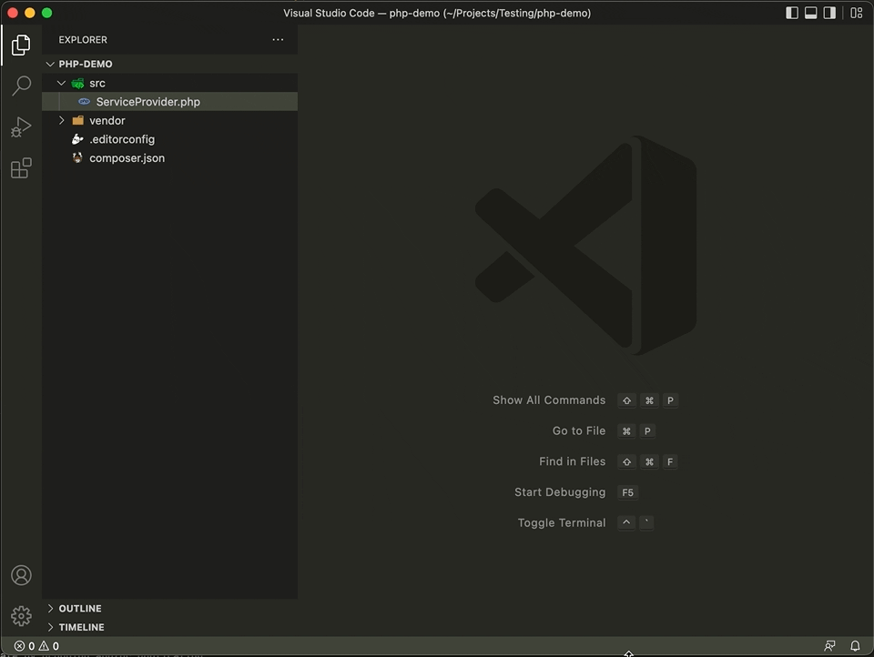

# PHP Support Utils

     

Improve PHP support like handling file classes, namespaces, etc

## Features

- Create PHP files, classes, traits, interfaces & enums
- Copy PHP objects files namespaces
- Some PHP snippets for classes, objects, etc

## Getting started

Install extension then set keyboard shortcuts as user preference, here are mine:

- `Cmd + Shift + C` Mac OS or `Ctrl + Shift + C` Windows: for the command called `Create PHP Object`, **this will replace one preset command which is the "Open external terminal" one**

## Acknowledgements

Huge thanks to this projects to make this possible:

- [php-parser](https://github.com/glayzzle/php-parser)
- [lodash](https://github.com/lodash/lodash)
- [vscode](https://github.com/microsoft/vscode)

## License

This project is open-sourced software licensed under the [MIT license](LICENSE.md).
